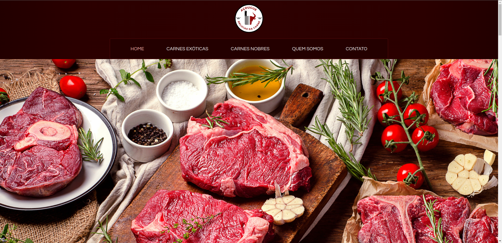

# Açougue Delícias da Carne
Este projeto é um site para um açougue. A principal função deste site é disponibilizar informações sobre o açougue, disponibilizando informações de localização, produtos, contatos e formulário. O site foi desenvolvido utilizando HTML, CSS e JavaScript.

## Visão Geral

Este projeto tem como objetivo fornecer informações sobre um estabelecimento comercial. O site contém as seguintes seções principais:

- **Home:** Uma introdução sobre mim e uma breve visão geral do conteúdo do site.
- **Carnes Exóticas:** Sessão de produtos.
- **Carnes Nobres:** Sessão de produtos.
- **Quem Somos:** Detalhes institucionais sobre o estabelecimento.
- **Contato:** Informações para contato e formulário de boletin informativo.

## Como Usar

Clone este repositório em sua máquina, depois abra o arquivo `index.html` no seu navegador para visualizar localmente.

```bash
git clone https://github.com/leandropereira-dev/meat-delicacies-butcher-shop.git
